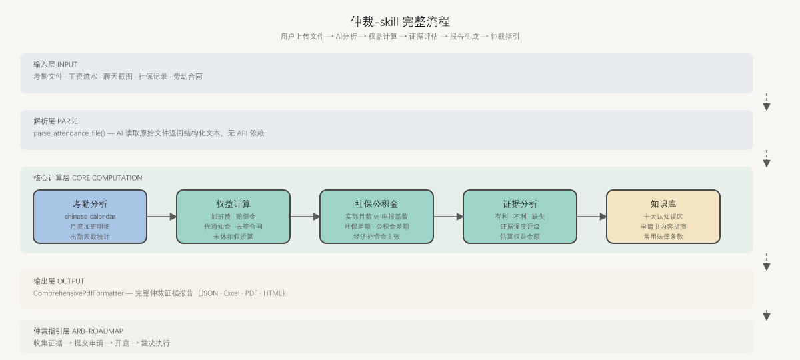

# 仲裁-skill

**帮普通员工收集证据、算清楚钱、准备材料。** 不做律师，做工具。



---

## 功能一览

| 功能 | 说明 |
|------|------|
| 📂 **文件解析** | 考勤 CSV/Excel 上传后 AI 自动解析，无需 API |
| 💰 **权益计算** | 加班费、违法解除赔偿金（2N）、代通知金、未签合同双倍、未休年假、社保/公积金差额 |
| 📋 **证据分析** | 有利 / 不利 / 缺失证据清单 + 证据强度评级 |
| 📄 **报告生成** | 一键导出 JSON / Excel / PDF / HTML 完整证据包 |
| ⚖️ **仲裁指引** | 操作路线图 + 申请书模板 + 十大认知误区 + 法律条款库 |

---

## 安装

```bash
pip install -r requirements.txt
```

---

## 快速使用

```python
# 1. 解析考勤文件（AI 读取，返回结构化文本）
from src.tools.file_reader import parse_attendance_file
text = parse_attendance_file("考勤.xlsx")

# 2. 计算权益（支持按月明细 + 中国日历）
from src.calculators.rights_calc import calculate_rights
r = calculate_rights(
    base_salary=15000,
    monthly_overtime={"2025-03": 12.5, "2025-04": 8.0},
    work_months=24,
    is_illegal_termination=True,
)
print(f"总金额: {r.total_claims:.2f} 元")

# 3. 社保差额分析
from src.calculators.social_security import analyze_social_security
gap = analyze_social_security(actual_salary=15000, declared_salary=8000, work_months=24)
print(f"累计差额: {gap.total_gap:.2f} 元")

# 4. 生成完整报告（PDF 或 HTML fallback）
from src.formatters.comprehensive_fmt import ComprehensiveReportData, ComprehensivePdfFormatter, EvidencePoint
data = ComprehensiveReportData(
    username="张三",
    company_name="XX科技有限公司",
    period_start="2025-01-01",
    period_end="2025-12-31",
    base_salary=15000.0,
    total_claims=59310.0,
    favorable_points=[
        EvidencePoint(type="favorable", description="口头辞退无书面材料属违法解除",
                     legal_basis="《劳动合同法》第48条", weight="重要")
    ],
    evidence_strength="中 - 建议补充书面辞退通知",
    legal_basis=["《劳动合同法》第48条 - 违法解除", "《劳动合同法》第87条 - 2N赔偿"],
)
fmt = ComprehensivePdfFormatter(output_dir="./output")
path = fmt.format(data)  # weasyprint 可用时输出 PDF，否则输出 HTML
```

---

## 报告结构

生成的证据包包含以下章节：

1. **封面** — 当事人信息 + 基准月薪
2. **仲裁请求总额** — 各项金额汇总
3. **考勤数据分析** — 月度加班明细表
4. **权益计算明细** — 计算过程 + 法律依据
5. **社保/公积金差额** — 实际月薪 vs 申报基数对比
6. **证据分析** — 有利 / 不利 / 缺失证据点
7. **法律依据**
8. **附录：十大认知误区** — 员工常犯的法律认知错误及正确理解

---

## 内置劳动法知识库

| 法条 | 内容 |
|------|------|
| 《工资支付暂行规定》第13条 | 加班费计算标准（平日150%/休日200%/法定假日300%） |
| 《劳动合同法》第38条 | 员工可解除合同的情形 |
| 《劳动合同法》第40条 | 代通知金（1个月工资） |
| 《劳动合同法》第47条 | 经济补偿计算标准（N） |
| 《劳动合同法》第48条 | 违法解除劳动合同的赔偿 |
| 《劳动合同法》第82条 | 未签合同双倍工资 |
| 《劳动合同法》第87条 | 2N赔偿金标准 |
| 《职工带薪年休假条例》第5条 | 未休年假折算（300%） |
| 《劳动争议调解仲裁法》第27条 | 一年仲裁时效 |

---

## 用户操作流程

```
收集证据 → 上传给 Agent 分析 → 计算权益金额 → 生成报告 → 提交仲裁申请
```

详见 [docs/ARB-ROADMAP-用户操作指南.md](docs/ARB-ROADMAP-用户操作指南.md)。

---

## 项目结构

```
src/
├── calculators/              # 权益计算
│   ├── rights_calc.py         # 加班费 / 赔偿金 / 代通知金 / 未签合同 / 未休年假
│   └── social_security.py    # 社保 / 公积金缴纳差额分析
├── formatters/             # 报告输出
│   ├── json_fmt.py           # JSON 格式化
│   ├── excel_fmt.py          # Excel 格式化
│   └── comprehensive_fmt.py   # 综合证据报告（PDF / HTML）
├── tools/                  # Skill 工具接口
│   └── file_reader.py        # AI 驱动的文件解析
├── analyzer/               # 证据分析器
├── knowledge/              # 劳动法知识库
└── parsers/               # 备用解析器（CSV / Excel）
docs/
├── ARB-ROADMAP-用户操作指南.md    # 完整仲裁路线图
├── ARB-GUIDE-申请书内容指南.md     # 申请书填写模板
└── ARB-KNOWLEDGE-十大认知误区.md   # 十大认知误区
templates/
└── comprehensive_evidence.html   # 报告 Jinja2 模板
```

---

## 环境说明

- Python 3.10+
- `weasyprint` 需要 Linux/macOS 或 Windows + GTK3；Windows 环境自动回退为 HTML 输出
- 仲裁 PDF 可在 Linux/macOS 或通过 Docker 生成

---

## 许可证

MIT
